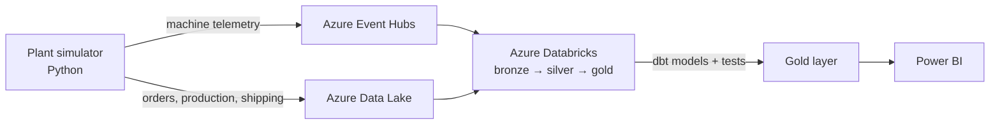

# AC Metais Data Platform

End-to-end data engineering platform on **Azure** for a laser cutting and metal fabrication plant: from simulated shop-floor events to production planning (PCP) insights.

> 🚧 **Work in progress** — see the [Roadmap](#roadmap) for current status.

## The problem

AC Metais is a Brazilian company that develops products with laser cutting, locksmithing and boilermaking. Every order follows the same path:

```
Order → Laser cutting → Locksmithing / Boilermaking → Finishing → Shipping
```

Questions the business asks every day, and that are hard to answer without a data platform:

- **Where is the bottleneck?** Which stage is slowing orders down?
- **Will this order be late?** What is the real lead time of each stage?
- **How efficient is the laser?** How much time is it idle, and how much sheet metal becomes scrap?
- **What is the real margin of each order** after scrap, rework and machine hours?
- **Are we delivering on time?**

## The solution

A cloud data platform that collects shop-floor and business events, organizes them in a lakehouse and turns them into decisions for production planning, finance and logistics.



### Modules

| Module | Business question | Main techniques |
|---|---|---|
| **Production planning (PCP)** | Bottlenecks, lead time per stage, late orders | Event modeling, daily snapshots |
| **Laser machines** | Uptime, OEE, sheet metal yield and scrap | Streaming, time windows, high volume |
| **Finance** | Real margin per order | Costing, slowly changing dimensions, real BRL exchange rates |
| **Logistics** | On-time delivery, freight cost | Shipping integration, OTD metrics |

## Tech stack

**Cloud:** Azure (Data Lake Storage, Event Hubs, Databricks, Key Vault, Monitor)
**Processing:** Python, PySpark, SQL, Delta Lake
**Transformation:** dbt
**Orchestration:** Azure Data Factory / Databricks Workflows
**Infrastructure & DevOps:** Terraform, Docker, GitHub Actions
**Visualization:** Power BI

## Roadmap

- [ ] **Phase 0 — Foundations:** local environment, Git, Docker, Terraform basics
- [ ] **Phase 1 — Plant simulator:** Python generating orders, production orders and stage events
- [ ] **Phase 2 — Batch lakehouse:** Data Lake + Databricks with bronze, silver and gold layers
- [ ] **Phase 3 — PCP modeling:** dbt models for lead time, bottlenecks and data quality tests
- [ ] **MVP:** first Power BI dashboard
- [ ] **Phase 4 — Laser streaming:** real-time machine telemetry, OEE and scrap
- [ ] **Phase 5 — Automation:** orchestration, CI/CD and full infrastructure as code
- [ ] **Phase 6 — Finance & logistics:** margin per order and on-time delivery
- [ ] **Phase 7 — Showcase:** final dashboards, documentation and demo video

## About the data

All data in this project is **synthetic**, generated by a simulator built for this project. The production flow and business problems are based on the real operation of AC Metais, used with the owner's permission. No real company data is published.

## Author

**Lucas Fernandes Nunes** · [GitHub](https://github.com/lucasnunesf) · [LinkedIn](https://www.linkedin.com/in/lucas-fernandes-nunes-335867256/)
